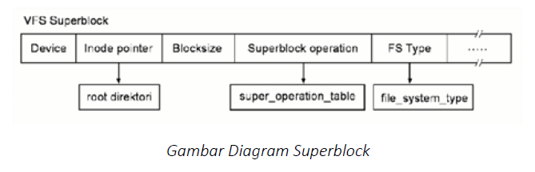
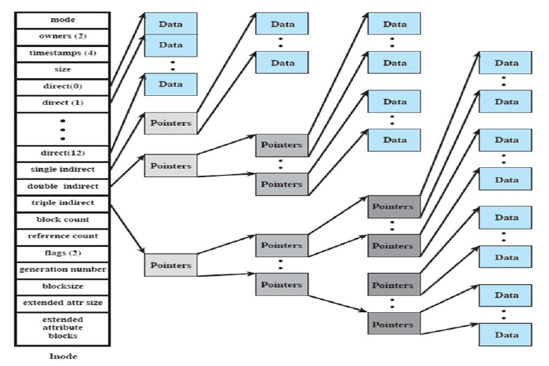
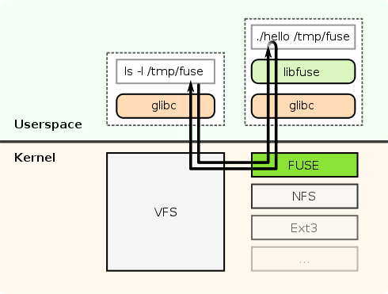

# SISOP MODUL 4

Requirement:
1. Linux
2. FUSE
3. gcc / g++

## Objectives
1. Peserta mengetahui file system
2. Peserta mengetahui FUSE
3. Peserta mampu mengimplementasikan FUSE

## Daftar Isi
- [1. File System](https://github.com/rohanaq/sisop-modul-4#1-file-system)
- [1.1 Tipe File System](https://github.com/rohanaq/sisop-modul-4#11-tipe-file-system) 
- [1.2 Virtual File System](https://github.com/rohanaq/sisop-modul-4#12-virtual-file-system)
- [1.3 Dentry](https://github.com/rohanaq/sisop-modul-4#13-dentry)
- [1.4 Superblock](https://github.com/rohanaq/sisop-modul-4#14-superblock)
- [1.5 Inode](https://github.com/rohanaq/sisop-modul-4#15-inode)
- [2. File System in Userspace (FUSE)](https://github.com/rohanaq/sisop-modul-4#2-file-system-in-userspace-fuse)
- [2.1 Instalasi Fuse](https://github.com/rohanaq/sisop-modul-4#21-instalasi-fuse)
- [2.2 Membuat File System dengan Fuse](https://github.com/rohanaq/sisop-modul-4#22-membuat-file-system-dengan-fuse)

# 1. File System
File System adalah struktur logika yang digunakan untuk mengendalikan akses terhadap data yang ada pada harddisk. Terdapat berbagai jenis-jenisnya dan penggunaan algoritma yang berbeda. Semakin baru jenis dari sebuah File System, maka semakin bagus pula kualitas dari File System tersebut.

### 1.1 Tipe File System
**1. File System Disk**

Sebuah file system disk adalah file system yang didesain untuk menyimpan data pada sebuah media penyimpan data. Contohnya: FAT (FAT 12, FAT 16, FAT 320), NTFS, HFS, HFS+, ext2, ext3, ext4, ISO 9660, ODS-5 dan UDF.

**2. File System Flash**

Sebuah file system Flash adalah file system yang didesain untuk menyimpan data pada media flash memory. Hal ini menjadi lazim ketika jumlah perangkat mobile semakin banyak dan kapasitas memory flash yang semakin besar.

**3. File System Database**

Konsep baru untuk manajemen file adalah konsep file system berbasis database. Sebagai perbaikan bagi Manajemen terstruktur hirarkis, file diidentifikasi oleh karakteristiknya, seperti tipe file, topik, pembuat atau metadata yang sama.

**4. File System Transaksional**

Setiap operasi disk dapat melibatkan perubahan ke sejumlah file dan struktur disk yang berbeda. Dalam 
banyak kasus, perubahan ini berhubungan. Hali in iberarti bahwa operasi ini dieksekusi pada waktu yang sama.

**5. File System Jaringan**

File System Network adalah file system yang bertindak sebagai klien untuk protokol akses file jarak jauh, memberikan akses ke file pada sebuah server. Contoh dari File system network ini adalah klien protokol NFS, AFS, SMB, dan klien FTP dan WebDAV

**6. File System untuk Tujuan Khusus**

File System untuk tujuan khusus adalah file system yang tidak termasuk disk file system atau file system Jaringan. Termasuk dalam kategori ini adalah sistem di mana file ditata secara dinamis oleh software, ditujukan untuk tujuan tertentu seperti untuk komunikasi antar proses komputer atau space file sementara. Contohnya file system procfs (/proc) yang dipakai oleh beberapa varian Unix.

**7. File System Journaling**

File system yang mencatat perubahan ke dalam jurnal (biasanya berupa log sirkuolar dalam area tertentu) sebelum melakukan perubahan ke file system. Filesystem seperti ini memiliki kemungkinan yang lebih kecil mengalami kerusakan saat terjadi power failure atau system crash.

### 1.2 Virtual File System
**Virtual file system** adalah suatu lapisan perangkat lunak dalam kernel yang menyediakan interface sistem berkas untuk program userspace. Virtual file system berfungsi agar berbagai sistem berkas yang berbeda dapat di akses oleh aplikasi komputer dengan cara yang seragam. VPS menyediakan antarmuka antara system call dengan system yang sesungguhnya.

### 1.3 Dentry
Dentry atau Directory Entry merupakan sebuah struktur data yang memiliki tugas sebagai penerjemah nama berkas ke inode-nya. Contoh informasi yang disimpan dalam dentry adalah name, pointer to inode, pointer to parent dentry, Use Count dan lainnya. Adapula command dalam VFS dentry adalah D_compare , D_delete , D_release.

### 1.4 Superblock
Setiap sistem berkas yang di-mount akan direpresentasikan oleh sebuah VFS Superblock. Superblock digunakan untuk menyimpan informasi mengenai partisi tersebut. Superblock menyimpan informasi sebagai berikut:
- Device: Merupakan suatu device identifier, contohnya /dev/hda1 adalah harddisk pertama yang terdapat pada sistem memiliki device identifier 0×300.
- Inode Pointer: Merupakan suatu pointer yang menunjuk ke inode pertama pada sistem berkas.
- Blocksize: Menunjukkan ukuran suatu block dari sistem berkas, contohnya 1024 bytes.
- Superblock Operation: Merupakan suatu pointer ke sekumpulan superblock routine (fungsi) dari sistem berkas, contohnya read, write, dan sebagainya.
- File System Type: Menunjukkan tipe dari sistem berkas, contohnya EXT2, FAT, NTFS.
- File System Specific: Merupakan suatu pointer ke informasi yang dibutuhkan oleh
sistem berkas.

### 1.5 Inode
Inode adalah abstraksi VFS untuk berkas. Setiap berkas, directory, dan data lainnya pada VFS direpresentasikan oleh satu dan hanya satu VFS inode. VFS inode hanya terdapat di memori kernel dan disimpan di inode chace selama masih dibutuhkan oleh sistem. Informasi yang disimpan oleh VPS Inode diantaranya:
- Device: Menunjukan device identifier dari suatu device yang menyimpan berkas, ataupun directory.
- Inode Number: Merupakan nomor inode yang unik dalam sistem berkas.
- Mode: Menggambarkan apa yang direpresentasikan oleh VFS inode.
- User ID: Merupakan identifier bagi pemilik berkas.
- Time: Menunjukkan kapan pembuatan, modifikasi, dan penulisan suatu berkas.
- Blocksize: Menunjukkan ukuran dari block yang digunakan oleh berkas.
- Inode Operations: Merupakan pointer ke suatu routine yang melakukan berbagai operasi pada inode.
- Count: Menunjukkan berapa kali suatu sistem telah menggunakan suatu inode.
- Lock: Digunakan untuk mengunci VFS inode.
- File System Specific Information: Menunjukkan informasi khusus yang dibutuhkan oleh suatu inode.

# 2. File System in Userspace (FUSE)
Filesystem in Userspace (FUSE) merupakan mekanisme sistem operasi untuk sistem operasi Unix-like yang memungkinkan pengguna tidak ber-hak istimewa menciptakan file system mereka sendiri tanpa mengubah kode kernel. Hal ini dicapai dengan menjalankan kode file system di userspace, sedangkan modul FUSE hanya menyediakan "jembatan" untuk antarmuka kernel yang sebenarnya.

Modul kernel FUSE dan FUSE library berhubungan melalui sebuah special file descriptor yang didapatkan dengan membuka /dev/fuse. File ini dapat terbuka berkali-kali dan file deskriptor yang diperoleh diteruskan ke mount syscall, untuk menyesuaikan deskriptor dengan filesystem mount. FUSE kernel module meneruskan request ke aplikasi fuse anda dan aplikasi anda memerintahkan fuse dengan cara menjawab request. 

### 2.1 Instalasi Fuse
1. Download FUSE dari http://fuse.sourceforge.net/ pada bagian Download stable
release
2. Extract file tar.gz dan masuk ke direktori FUSE. (tar –xvzf fuse-2.9.4.tar.gz)
3. Lakukan installasi FUSE dengan cara:
a. Gunakan hak akses super user (sudo su)
b. Ketikkan perintah ./configure
c. Ketikkan perintah make
d. Ketikkan perintah make install
4. FUSE siap digunakan

### 2.2 Membuat File System dengan FUSE
